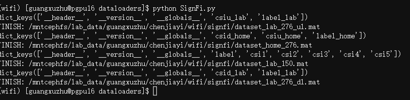

# SignFi: Sign Language Recognition using WiFi



This folder provides a PyTorch dataloader and preprocessing script for the **SignFi** dataset. We do **not** provide the raw data; please download it from the official source.

## 1. Download Raw Data

The SignFi dataset was proposed in the paper:
> **"SignFi: Sign Language Recognition using WiFi"**  
> Yonghao Ma, Gang Zhou, Shuangquan Wang, Hongyang Zhao, Woosub Jung.  
> *Proceedings of the 24th Annual International Conference on Mobile Computing and Networking (MobiCom)*, 2018.

You can download the raw `.mat` files from the official project page or repository:
*   **Official Website / Repository**: [https://github.com/YonghaoM/SignFi](https://github.com/YonghaoM/SignFi) (or search for "SignFi dataset" if the link is outdated).

Please place the downloaded `.mat` files (e.g., `dataset_lab_276_dl.mat`, `dataset_home_276_dl.mat`, etc.) into the following directory structure:

```
wifi_data/
└── SignFi/
    ├── dataset_lab_276_dl.mat
    ├── dataset_home_276_dl.mat
    └── ...
```

## 2. Preprocessing

The raw `.mat` files need to be converted into a more efficient `.npz` format for faster loading in Python. We provide a script to do this automatically.

Run the preprocessing script:

```bash
python datas/dataloaders/SignFi/SignFi_preprocess.py --root_folder wifi_data/SignFi
```

This will:
1.  Read all `.mat` files in `wifi_data/SignFi`.
2.  Extract CSI amplitude (`abs`) and phase (`ang`).
3.  Compute global normalization statistics (mean/std).
4.  Save everything into a single optimized file: `wifi_data/SignFi/all_processed.npz`.

## 3. Usage

After preprocessing, you can use the dataloader in your project:

```python
from datas.dataloaders.SignFi.SignFi_dataloader import signfi_dataloader

# Create train and test loaders
train_loader, test_loader = signfi_dataloader(
    folder_path="wifi_data/SignFi",
    batch_size=32,
    use_normalize=True,  # Automatically uses the pre-computed mean/std
    num_classes=276      # Optional: filter for specific number of classes
)

for csi, label in train_loader:
    print(csi.shape)   # [32, 3, 30, 200] (Dimensions may vary based on reshaping)
    print(label.shape) # [32]
```

## Citation

If you use this dataset, please cite the original paper:

```bibtex
@inproceedings{ma2018signfi,
  title={SignFi: Sign Language Recognition using WiFi},
  author={Ma, Yonghao and Zhou, Gang and Wang, Shuangquan and Zhao, Hongyang and Jung, Woosub},
  booktitle={Proceedings of the 24th Annual International Conference on Mobile Computing and Networking},
  pages={377--392},
  year={2018}
}
```

---
*Note: This repository only provides the data loading and preprocessing utilities for PyTorch. All rights to the dataset belong to the original authors.*
